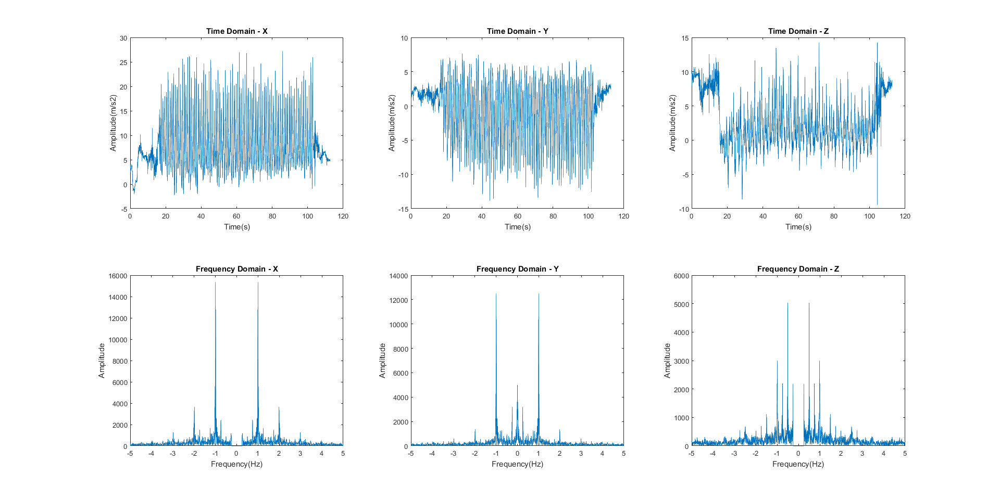
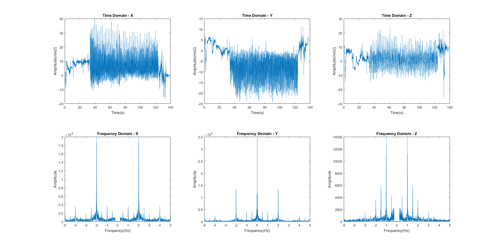

## What?

ConductAid is a set of wearable devices that help visually-impaired musicians
in orchestras, by translating the motions of the conductor as haptic feedback
to the musicians.

conductaid consists of two devices: a wearable wireless sensing device that straps on to the hand of the conductor, and a feedback device worn on the arm/wrist of the musician. An accelerometer on the sensing device reads the movements of the conductor, and determines three parameters:

  * **Tempo:** The speed at which the music is played, and changes in the speed (slowing down or speeding up). The conductor moves their hand/baton in time with the beat.
  * **Volume:** How loud the music is played, and how that changes - crescendo (increasing volume) or decrescendo (decreasing volume). Indicated by how widely the conductor swings the baton - wider movements mean higher volume.
  * **Cueing:** The instructions for each musician/section to begin playing, indicated by pointing the conductor pointing their hand or baton.

These parameters of the musical performance are some of the most critical, and difficult to ascertain, factors for visually-impaired musicians. ConductAid determines these three parameters based on the accelerometer data, and transmits feedback to the musician's wearable in the form of haptic feedback that alerts the musician to important changes in the music.

## Why?

From Ray Charles to Stevie Wonder, from Ronnie Millsap to Andrea Bocelli, many
musicians let the world enjoy their music, despite their visual impairments.

Despite music is a ubiquitous outlet for visually impaired members of the
society, there are no methods in place to allow visually impaired musicians
to perform in orchestras.

conductaid is aiming to remove the communication barrier between the conductor
and the visually impaired musicians - and is asking your help in doing so.

## How?

Coding and algorithms.

### Tempo

In order to determine the current tempo of the music, we analyze the accelerometer data to determine the most prominent frequencies of movement. Specifically, we focus on acceleration along the x-axis of the accelerometer.

> Insert diagram of our model here

Based on our simplified model of the arm in which only the elbow and the wrist are bending, any up/down movement of the hand is going to require some rotation, at either the elbow or the wrist. This causes acceleration toward the elbow, as shown in the figure above. In the reference frame of the accelerometer, the x-axis will be mostly pointing toward the elbow of the wearer; so, rotating one's arm down will cause a noticeable acceleration in the x-axis of the sensor.

Because most conducting patterns involve one up/down motion per beat, the x-acceleration should be roughly periodic with a period of one beat. Based on this, we can take the Fourier transform of the x-acceleration data, filter it, and extract the most prominent frequency.

> Insert FFT diagrams showing peaks here

As can be seen in the above figure, there is a noticeable spike in the FFT at the frequency corresponding to BPM/60, (aka the beats per second). We can use this to determine the tempo of the music based on the Fourier transform of the x-acceleration data.

### Volume

### Cue

### Livestreaming Proof of Concept

<iframe width="560" height="315" src="https://www.youtube.com/embed/Gs7KTd38o4Y" frameborder="0" allowfullscreen></iframe>

### Source Code

## Future Steps
