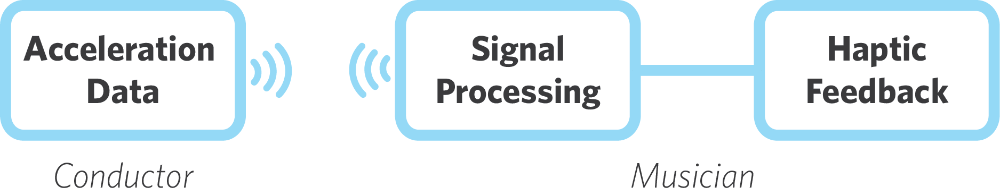
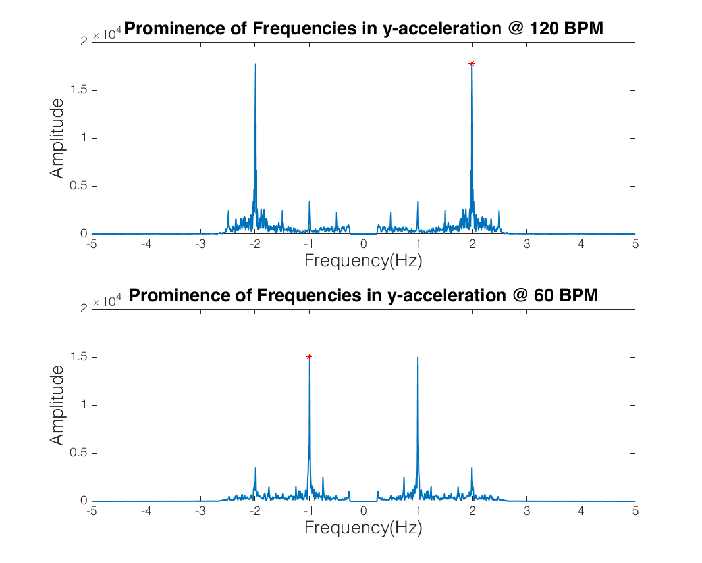
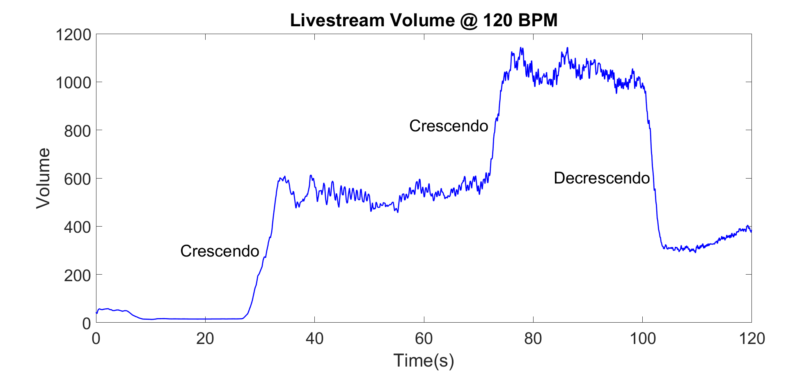

## ConductAid: Helping Visually-Impaired Musicians

For musicians in orchestras, reading the conductor's movements is critical; however, the conductor is often far away from many members of the orchestra, which is an issue for visually-impaired musicians. We've designed a solution for that issue - ConductAid is a set of wearable devices that help visually-impaired musicians by translating the motions and instructions of the conductor to the musicians through haptic feedback.

## Our Purpose

From Ray Charles to Stevie Wonder, from Ronnie Millsap to Andrea Bocelli, many
musicians let the world enjoy their music despite their visual impairments. Although music is an important outlet for many visually impaired people, there are no methods in place to allow visually impaired musicians to perform in orchestras. ConductAid is aiming to remove the communication barrier between the conductor and the musicians.

## How it Works

ConductAid consists of two devices: a wearable wireless sensing device that straps on to the hand of the conductor, and a feedback device worn on the arm/wrist of the musician. An accelerometer on the sensing device reads the movements of the conductor, and determines three parameters:

  * **Tempo:** The speed at which the music is played, and changes in the speed (slowing down or speeding up). The conductor indicates tempo by moving their hand or baton in time with the beat.
  * **Volume:** How loud the music is played, and how that changes - crescendo (increasing volume) or decrescendo (decreasing volume). Indicated by how widely the conductor swings the baton - wider movements are louder.
  * **Cueing:** The instructions for each musician/section to begin playing, indicated by pointing the conductor pointing their hand or baton.

These parameters of the musical performance are some of the most critical factors for musicians playing in an orchestra. ConductAid determines these three parameters based on the sensor data, and transmits feedback to the musician's wearable in the form of haptic feedback that alerts the musician to important changes in the music.

### Real-time Sensing and Analysis

ConductAid utilizes an accelerometer to provide data on the acceleration of the conductor's hand.

In order to provide real-time feedback to the musician, we have to be able to analyze data in real-time. To accomplish this, we stream the accelerometer data from the accelerometer (on the conductor's device) to the musician where it's analyzed in order to determine the parameters and provide haptic feedback.

## Determining the Parameters

For our proof of concept, we focused on analysis of the accelerometer data. In order to quickly test our analysis, we set up the accelerometer on a smartphone to stream data to a computer for analysis. We conducted experiments by having multiple users conduct at various tempos (60 - 120 BPM) and at different time signatures (4/4, 3/4 and 6/8). From that, we analyzed the data for our parameters of interest:

### Tempo

In order to determine the current tempo of the music, we analyze the accelerometer data to determine the most prominent frequencies of movement. Specifically, we focus on acceleration along the y-axis of the phone accelerometer:

</img>

Based on our simplified model of the arm in which only the elbow and the wrist are bending, any up/down movement of the hand is going to require rotation at either the elbow or the wrist.

</img>

When the phone accelerometer is oriented as in the figure above, this movement causes acceleration toward the elbow, because in the reference frame of the accelerometer, the y-axis will be mostly pointing toward the elbow of the wearer; so, rotating one's arm down will cause a noticeable acceleration in the y-axis of the sensor.

Because most conducting patterns involve one up/down motion per beat, the y-acceleration should be roughly periodic with a period of one beat. Based on this, we can take the Fourier transform of the y-acceleration data, filter it, and extract the most prominent frequency.

We begin by filtering the data, limiting it to frequencies less than ~3 Hz, as that is the highest frequency we expect. As can be seen in the above figure, there is a noticeable spike in the amplitude at the frequency corresponding to BPM/60 (i.e. the beats per second) - when the conducting is being done at 120 BPM the spike is at 2 Hz, and at 60 BPM the spike is at 1 Hz. We can use this to determine the tempo of the music based on the Fourier transform of the x-acceleration data.

### Volume

Even though there are various conventions on how a conductor communicates volume
to their orchestra, one of the most common ways is by the size of their motions -
larger motions indicating larger volume.

In order to translate that motion to the musicians, a Fourier Analysis is performed
on the livestream data that is received from the accelerometers, and is filtered
based on the tempo of the movements. Based on this filtering, the trailing averages
of the amplitudes of the overruling frequency (which is also the tempo of the music piece),
give the volume of the song.

Based on the abrupt changes in volumes, musicians can be alerted on when they should
play more or less loudly.

The livestream application of the algorithm can be seen on the plot above, where three
different volume levels were tested. As seem on the plot, when the conductor changes
the sizes of their movements, there is dramatic change in the volume output of
the algorithm, from which crescendo (increase in volume) and decrescendo (decrease in
volume) can be obtained.

### Cues

In order to detect cueing, we perform similar analysis to the tempo detection. Because cueing is indicated by pointing, the same acceleration should occur along the y axis - except we're now looking for a single spike instead of the frequency.

As can be seen in the figure above, cues correspond to spikes in the y-acceleration. We detect cues by looking at the local maxima of the y-acceleration. From that, we filter the peaks to include peaks in acceleration that "fall off" with a certain steepness, selecting only peaks above a certain threshold.

### Livestreaming Proof of Concept

<iframe width="560" height="315" src="https://www.youtube.com/embed/Gs7KTd38o4Y" frameborder="0" allowfullscreen></iframe>

Over the course of the music piece, the volume information from a time interval is
averaged and communicated to the musician.

## Future Steps

Being a relatively new project with a lot of room for improvement, there are
several future steps that would bring ConductAid closer to being a reality.

### Translating Quantitative Results for the Musicians

Some of the results of the current state of the product are in forms that would
not make sense too much  or would not be too valuable of a feedback for a
musician. For this reason, one of the immediate future steps that can be taken
include translating the quantitative results for volume into terms that would
make sense for a musician.

This requires more research into music theory and collaboration with orchestra
conductors, possibly gathering data from different orchestra conductors and
training the algorithm to distinguish between different sizes of motion patterns.

### Integrating the Current System with Haptic Feedback

Haptic feedback is selected as the mode to communicate information to the
musicians, due to not wanting to impair their hearing with an audible feedback
system; however since no work has been done about this portion of the product yet,
it is one of the priorities of the team, moving forward.

Collaboration with visually impaired musicians is necessary in order to optimize
the reliability and ergonomics of the device, so that it in its most helpful
and beneficial form.

## Source Code

ConductAid is an open-source project, and the team appreciates feedback from
anyone who would like to be involved in the improvement of the project.

GitHub: [ConductAid](https://github.com/otalu/conductaid)
